<div align="center">

# RelaMind - AI 个人成长伙伴

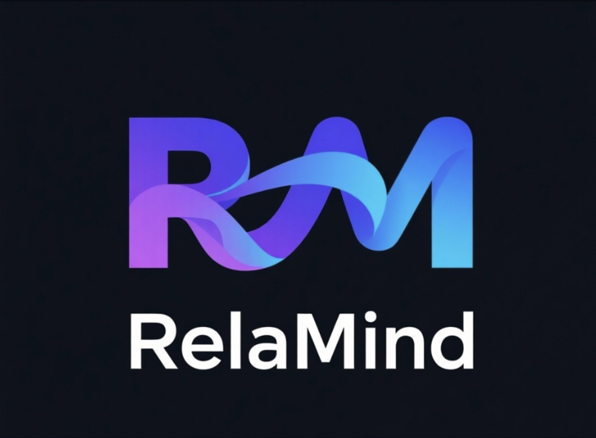

> 记录成长，理解自己，成为更好的你

</div>

RelaMind 是一个基于 AI 的个人成长轨迹分析系统，帮助用户通过记录生活、回顾历史、分析模式来更好地理解自己，实现持续成长。

## 📸 效果展示

### 主页
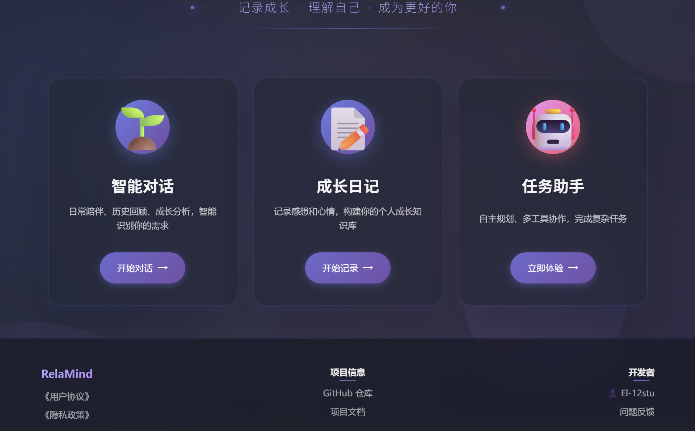
*主页展示三个核心功能：智能对话、成长日记、任务助手，采用现代化的渐变设计和动画效果*

### 智能对话 - 智能路由功能

智能对话系统支持自动识别用户意图，智能路由到最合适的处理方式：

#### 普通聊天模式
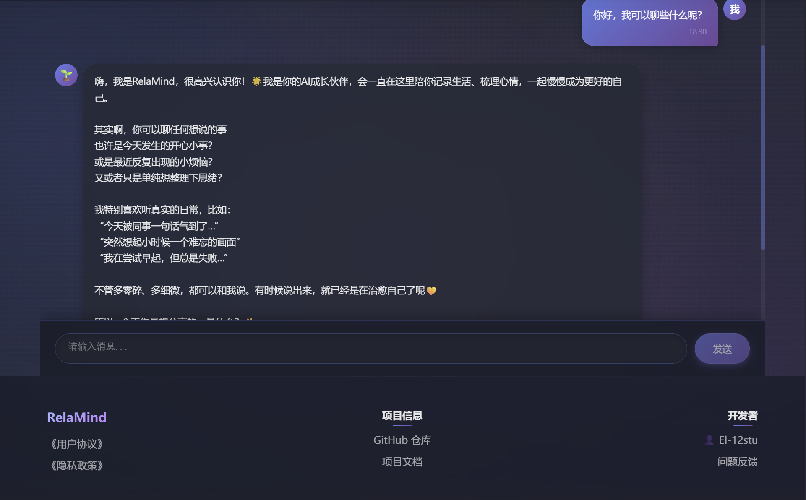
*日常陪伴聊天，情感支持，引导记录*

#### RAG 历史查询模式
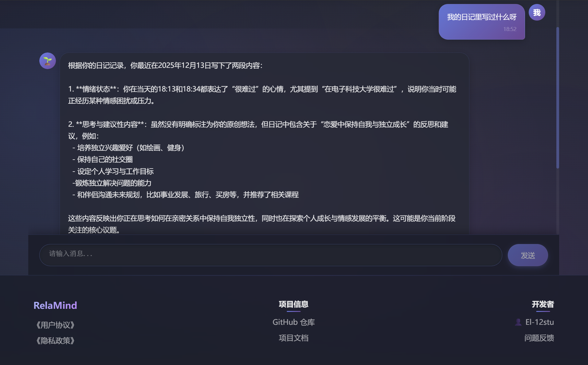
*自动检索历史记录，回答"我的日记里写过什么呢？"等问题*

#### 工具调用模式
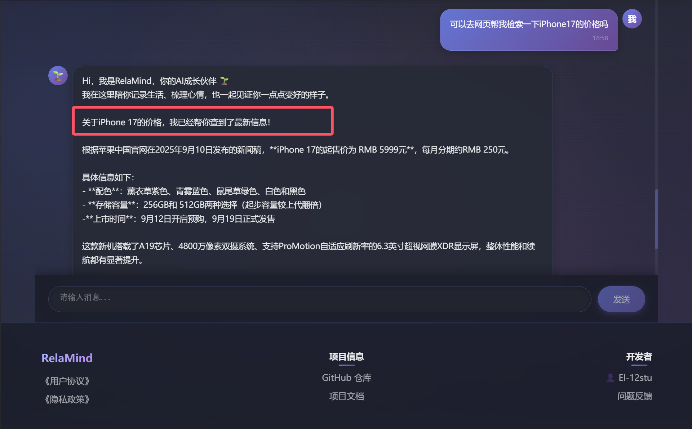
*自动调用搜索、下载、生成文件等工具完成任务*

### 智能路由识别过程

系统会自动识别用户意图并路由到对应模式：

#### 普通聊天路由
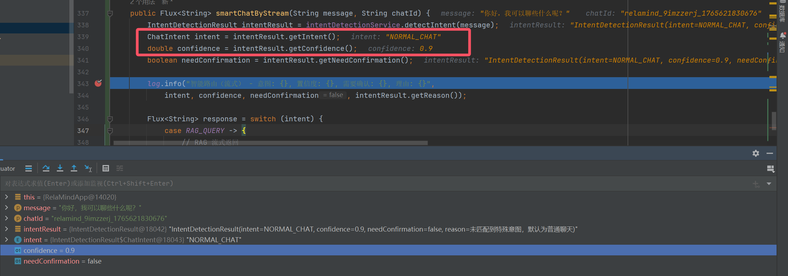
*系统识别为普通聊天意图，使用日常陪伴模式*

#### RAG 查询路由
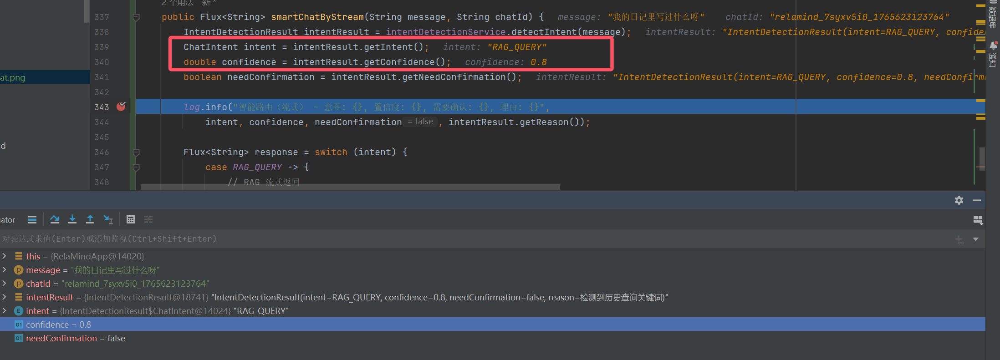
*系统识别为历史查询意图，自动使用 RAG 检索模式*

#### 工具调用路由
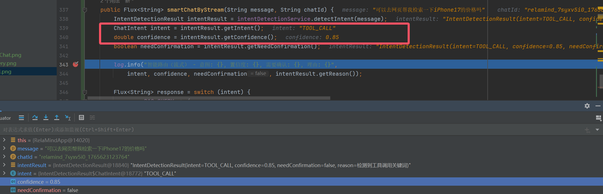
*系统识别为工具调用意图，自动调用相应工具*

### 成长日记
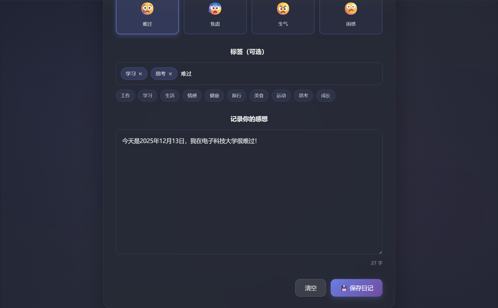
*成长日记记录界面，支持心情选择、标签管理、内容记录，自动存储到向量数据库*

### Manus 任务助手 🤖

Manus 是 RelaMind 的高级智能体，基于 ReAct（Reasoning and Acting）模式，能够自主规划复杂任务并执行多步骤操作。

#### 任务执行流程展示

**步骤 1：任务分析和规划**
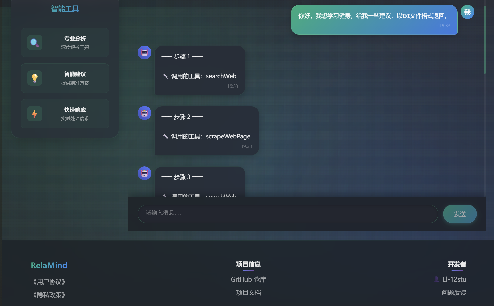
*Manus 分析用户需求，制定执行计划，展示思考过程和调用的工具*

**步骤 2：信息收集和处理**
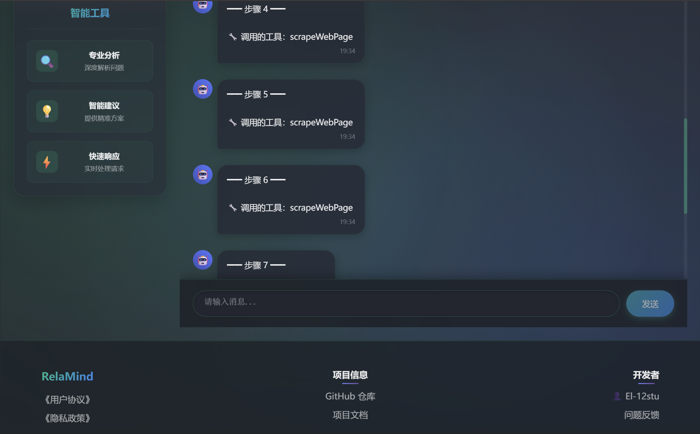
*Manus 自动调用搜索、网页抓取等工具收集信息，实时显示执行进度*

**步骤 3：内容生成和文件创建**
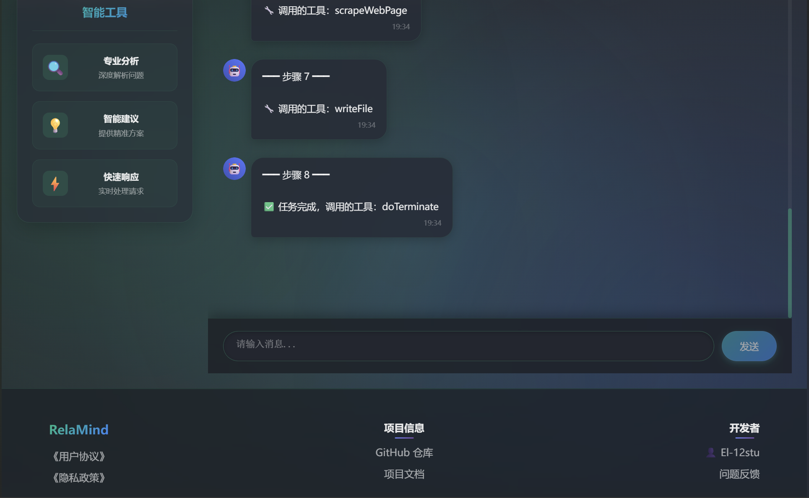
*Manus 整理信息并生成文件，支持 txt、PDF 等多种格式，提供下载链接*

**步骤 4：任务完成和结果展示**
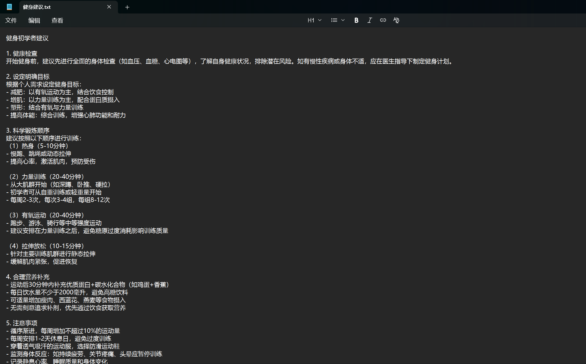
*任务完成后，Manus 展示最终结果和生成的文件，用户可直接下载*

**核心特性**：
- **流式输出**：每执行完一步立即显示，实时反馈任务进度
- **思考过程可视化**：清晰展示 AI 的思考内容和决策过程
- **工具调用透明化**：显示调用的工具名称，隐藏技术细节
- **文件自动生成**：支持生成 txt、PDF 等格式文件，并提供下载链接
- **多步骤协作**：自动协调多个工具完成复杂任务

### 敏感词检测 🛡️

系统内置敏感词检测功能，确保内容安全和合规性。

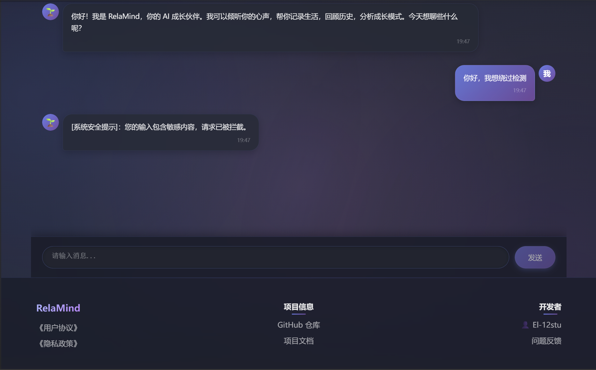
*当用户输入包含敏感词时，系统会立即拦截并提示，不调用大模型 API，保护系统安全*

**技术特点**：
- **Trie 树算法**：基于前缀树实现高效的敏感词匹配
- **零 API 调用**：检测到敏感词时直接拦截，不消耗大模型 API 资源
- **实时检测**：在请求发送到大模型前进行检测，响应速度快
- **可配置词库**：支持从配置文件加载敏感词库，便于维护和更新


## ✨ 产品定位

RelaMind 定位为"你的 AI 成长伙伴"，通过以下方式帮助用户：

- **日常陪伴**：倾听用户心声，给予情感支持和理解
- **引导记录**：鼓励用户记录生活点滴，养成记录习惯
- **成长分析**：基于历史记录分析成长模式，提供个性化洞察
- **主动关怀**：记住用户的重要信息，适时主动关心

## 🎯 核心功能

### 1. 智能对话 💬

**功能特点**：
- **智能路由**：自动识别用户意图（普通聊天 / 历史查询 / 工具调用），选择最合适的处理方式
- **日常陪伴**：多轮对话、情感支持、引导记录
- **历史检索**：基于 RAG 技术检索历史记录，回答"我去年这个时候在做什么？"等问题
- **工具调用**：自动调用搜索、下载、生成文件等工具
- **对话记忆**：基于 Cassandra 存储对话历史，实现长期记忆

**使用场景**：
- 日常聊天："今天心情不错"
- 历史查询："我去年这个时候在做什么？"
- 工具调用："帮我搜索一下今天的天气"

### 2. 成长日记 📝

**功能特点**：
- **心情记录**：8种心情选择（开心、兴奋、平静、疲惫、难过、焦虑、生气、困惑）
- **标签管理**：自定义标签 + 常用标签，便于分类和检索
- **RAG 存储**：自动存储到向量数据库，支持语义检索
- **元数据丰富**：自动记录日期、时间、心情、标签等信息

**使用场景**：
- 记录日常感想和心情
- 构建个人成长知识库
- 为后续的 RAG 检索提供数据源

### 3. Manus 任务助手 🤖

**功能特点**：
- **自主规划**：基于 ReAct（Reasoning and Acting）模式，自主推理和行动
- **多工具协作**：自动调用多个工具完成复杂任务（搜索、抓取、文件生成等）
- **多步骤执行**：支持复杂的多步骤任务规划，最多支持 10 步
- **流式输出**：每执行完一步立即显示，实时反馈任务进度
- **思考可视化**：清晰展示 AI 的思考过程和决策逻辑
- **文件生成**：自动生成 txt、PDF 等格式文件，并提供下载链接
- **工具调用透明化**：显示调用的工具名称，隐藏技术细节

**使用场景**：
- 制定完整的计划（如"帮我制定一个周末计划"）
- 信息收集和整理（如"帮我搜索学习健身的建议，以 PDF 格式返回"）
- 需要多步骤操作的任务（如"帮我搜索今天的新闻，整理成文档"）
- 复杂的信息处理（如"帮我分析某个主题，生成报告"）

**执行流程**：
1. **思考阶段**：分析用户需求，制定执行计划
2. **行动阶段**：调用相应工具（搜索、抓取、文件操作等）
3. **迭代执行**：根据结果继续思考，执行下一步
4. **任务完成**：生成最终结果和文件，提供下载链接

### 4. 智能意图识别 🧠

**技术特点**：
- **基于 LLM 的分类**：使用结构化输出进行意图分类，提高准确率
- **规则匹配**：快速规则匹配（默认），可切换为 LLM 分类
- **置信度机制**：当识别置信度较低时，主动询问用户确认
- **持续优化**：记录识别准确率，持续优化模型

### 5. 敏感词检测 🛡️

**功能特点**：
- **Trie 树算法**：基于前缀树实现高效的敏感词匹配，时间复杂度 O(n)
- **零 API 调用**：检测到敏感词时直接拦截，不消耗大模型 API 资源
- **实时检测**：在请求发送到大模型前进行检测，响应速度快
- **可配置词库**：支持从 `sensitive_words.txt` 配置文件加载敏感词库
- **Advisor 拦截**：通过 Spring AI Advisor 机制，在调用链早期拦截

**技术实现**：
- 使用 `SensitiveWordAdvisor` 作为最高优先级 Advisor（order = -100）
- 基于 Trie 树的多模式匹配算法
- 支持中英文敏感词检测
- 自动加载和初始化敏感词库

**使用场景**：
- 防止用户输入不当内容
- 保护系统安全，避免恶意请求
- 节省 API 调用成本

### 6. 工具调用能力 🔧

- **联网搜索**：实时搜索最新信息
- **文件操作**：保存、读取用户文件
- **网页抓取**：提取网页内容
- **资源下载**：下载图片、文档等资源
- **PDF 生成**：生成个性化报告
- **终端操作**：执行代码脚本

### 7. MCP 服务集成 🌐

- **地图服务**：查找附近地点、规划路线
- **图片搜索**：从特定网站搜索图片
- **扩展能力**：支持自定义 MCP 服务

## 🛠️ 技术栈

### 后端技术

- **Java 21** + **Spring Boot 3**
- **Spring AI**：AI 应用开发框架
- **LangChain4j**：AI 应用开发工具库
- **Cassandra**：对话记忆持久化存储
- **PgVector**：向量数据库，用于 RAG 检索
- **Spring AI ChatClient**：多轮对话、Advisor、ChatMemory
- **Spring AI RAG**：知识库检索增强生成
- **Spring AI Tool Calling**：工具调用能力
- **Spring AI MCP**：模型上下文协议支持

### AI 能力

- **大模型接入**：支持多种 AI 大模型（通义千问、GPT 等）
- **Prompt 工程**：优化的提示词设计
- **结构化输出**：使用 Entity 进行结构化数据提取
- **流式响应**：SSE 流式传输，提升用户体验
- **多模态支持**：支持文本、图片等多种输入

### 工具与库

- **Kryo**：高性能序列化
- **Jsoup**：网页抓取
- **iText**：PDF 生成
- **Knife4j**：API 文档生成

### 前端技术

- **Vue 3**：前端框架
- **Vite**：构建工具
- **SSE**：服务器推送事件，实现流式响应

### 部署

- **Docker**：容器化部署
- **Serverless**：支持 Serverless 部署

## 📁 项目结构

```
RelaMind/
├── src/main/java/io/el12stu/RelaMind/
│   ├── app/                    # 核心应用逻辑
│   │   └── RelaMindApp.java    # 智能路由、RAG、工具调用
│   ├── agent/                  # AI 智能体
│   │   ├── Manus.java          # 自主规划智能体
│   │   └── ReActAgent.java     # ReAct 模式智能体
│   ├── advisor/                # Spring AI Advisor
│   │   ├── SensitiveWordAdvisor.java
│   │   ├── IntentDetectionService.java
│   │   └── ...
│   ├── chatmemory/             # 对话记忆
│   │   └── CassandraBasedChatMemory.java
│   ├── rag/                    # RAG 相关
│   │   ├── RelaMindAppDocumentLoader.java
│   │   ├── QueryRewriter.java
│   │   └── ...
│   ├── service/                # 业务服务
│   │   ├── IntentDetectionService.java  # 意图识别
│   │   ├── DiaryService.java            # 日记存储服务
│   │   └── SensitiveWordService.java
│   ├── tools/                  # 工具定义
│   │   ├── WebSearchTool.java
│   │   ├── FileOperationTool.java
│   │   ├── PDFGenerationTool.java
│   │   └── ...
│   └── controller/             # API 接口
│       ├── AiController.java   # 智能对话接口
│       └── DiaryController.java # 日记记录接口
├── src/main/resources/
│   ├── application.yml         # 配置文件
│   └── document/               # 知识库文档
└── ai-agent-frontend/          # 前端项目
    └── src/
        ├── views/
        │   ├── Home.vue        # 主页（三个功能卡片）
        │   ├── RelaMind.vue    # 智能对话页面
        │   ├── Diary.vue       # 成长日记页面
        │   └── SuperAgent.vue  # 任务助手页面
        ├── components/
        │   └── ChatRoom.vue    # 聊天室组件
        └── api/
            └── index.js        # API 调用封装
```

## 🚀 快速开始

### 环境要求

- JDK 21+
- Maven 3.6+
- PostgreSQL（支持 PgVector）
- Cassandra（可选，用于对话记忆）

### 配置说明

1. 配置 AI 大模型 API Key（在 `application.yml` 中）
2. 配置数据库连接（PostgreSQL、Cassandra）
3. 配置向量数据库（PgVector）

### 运行项目

#### 方式一：本地开发运行

```bash
# 后端
mvn spring-boot:run

# 前端
cd ai-agent-frontend
npm install
npm run dev
```

#### 方式二：Docker 部署（推荐）🐳

**难度评估**：⭐⭐☆☆☆（简单到中等）

Docker 化已经完成，支持两种部署方式：使用预构建镜像（推荐）或本地构建。

**前置要求**：
- 安装 Docker 和 Docker Compose
- 配置 AI 大模型 API Key

---

### 🚀 方式 A：使用预构建镜像（推荐，最简单）

**优点**：无需构建环境，直接拉取使用，快速启动

```bash
# 1. 克隆仓库
git clone https://github.com/your-username/RelaMind.git
cd RelaMind

# 2. 创建配置文件
cp env.example .env

# 3. 编辑 .env 文件，配置以下内容：
#    - DASHSCOPE_API_KEY（必填）：你的阿里云 DashScope API Key
#    - GITHUB_USER（必填）：你的 GitHub 用户名
#    - GITHUB_REPO（必填）：仓库名（通常是 RelaMind）
#    - POSTGRES_PASSWORD（可选，建议修改）：数据库密码
#    - CASSANDRA_PASSWORD（可选，建议修改）：Cassandra 密码

# 4. 修改 docker-compose.prod.yml 中的镜像地址
#    将 your-username 替换为你的 GitHub 用户名
#    例如：ghcr.io/your-username/RelaMind/backend:latest

# 5. 启动所有服务
docker-compose -f docker-compose.prod.yml up -d

# 6. 查看服务状态
docker-compose -f docker-compose.prod.yml ps

# 7. 查看日志
docker-compose -f docker-compose.prod.yml logs -f backend
```

**访问应用**：
- 前端：http://localhost
- 后端 API：http://localhost:8123/api
- Swagger 文档：http://localhost:8123/api/swagger-ui.html

---

### 🔨 方式 B：本地构建镜像

**优点**：可以自定义构建参数，适合开发调试

```bash
# 1. 创建 .env 文件（可选，用于配置敏感信息）
cp env.example .env
# 编辑 .env 文件，至少配置 DASHSCOPE_API_KEY

# 2. 使用开发配置启动（会自动构建镜像）
docker-compose up -d --build

# 3. 查看服务状态
docker-compose ps

# 4. 查看日志
docker-compose logs -f backend
```

---

### 📋 配置说明

所有配置通过环境变量注入，**镜像中不包含任何敏感信息**。

**必填配置**：
- `DASHSCOPE_API_KEY`：阿里云 DashScope API Key

**可选配置**（有默认值）：
- `POSTGRES_USER`：默认 `relamind`
- `POSTGRES_PASSWORD`：默认 `relamind123`（⚠️ 生产环境建议修改）
- `CASSANDRA_USERNAME`：默认 `cassandra`
- `CASSANDRA_PASSWORD`：默认 `cassandra`（⚠️ 生产环境建议修改）

详细配置说明请查看 [CONFIGURATION.md](CONFIGURATION.md)

---

### 🛠️ 常用命令

```bash
# 启动服务
docker-compose -f docker-compose.prod.yml up -d

# 停止服务
docker-compose -f docker-compose.prod.yml down

# 停止并删除数据卷（⚠️ 会删除所有数据）
docker-compose -f docker-compose.prod.yml down -v

# 查看日志
docker-compose -f docker-compose.prod.yml logs -f backend

# 重启服务
docker-compose -f docker-compose.prod.yml restart backend

# 修改配置后重启
# 1. 修改 .env 文件
# 2. 重启服务
docker-compose -f docker-compose.prod.yml restart backend
```

---

### 📦 Docker 文件说明

- `Dockerfile`：后端应用镜像（多阶段构建，优化镜像大小）
- `ai-agent-frontend/Dockerfile`：前端应用镜像（Nginx 托管）
- `docker-compose.yml`：开发环境配置（本地构建镜像）
- `docker-compose.prod.yml`：生产环境配置（使用预构建镜像）
- `.dockerignore`：优化构建速度，排除不必要的文件

---

### ⚠️ 注意事项

1. **首次使用预构建镜像**：
   - 需要先修改 `docker-compose.prod.yml` 中的镜像地址
   - 替换 `your-username` 为你的 GitHub 用户名
   - 确保镜像已发布到 GitHub Container Registry

2. **端口占用**：
   - 确保端口 80、8123、5432、9042 未被占用

3. **数据持久化**：
   - 数据存储在 Docker volumes 中
   - 删除容器不会丢失数据
   - 使用 `docker-compose down -v` 会删除所有数据

4. **配置修改**：
   - 修改 `.env` 文件后，重启服务即可生效
   - 无需重新构建镜像

---

### 📚 更多文档

- [CONFIGURATION.md](CONFIGURATION.md) - 详细配置说明
- [DEPLOYMENT.md](DEPLOYMENT.md) - 完整部署指南

## 📝 使用示例

### 智能对话示例

**普通聊天**：
```
用户：今天心情不错
AI：太好了！能分享一下是什么让你心情这么好吗？要不要记录下来，这样以后可以回顾一下这些美好的时刻。
```

**历史记录查询（自动使用 RAG）**：
```
用户：我去年这个时候在做什么？
AI：根据你2023年3月的记录，当时你正在准备一个重要的项目，还记录了一些关于工作压力的思考...
```

**工具调用（自动调用工具）**：
```
用户：帮我搜索一下今天的天气
AI：[自动调用搜索工具] 根据搜索结果，今天天气晴朗，温度...
```

### 成长日记示例

用户可以通过界面记录：
- 选择心情：😊 开心
- 添加标签：工作、思考
- 输入内容：今天完成了一个重要项目，感觉很有成就感...

保存后，这些记录会自动存储到向量数据库，后续可以通过智能对话检索。

### Manus 任务助手示例

**示例 1：生成学习建议文档**
```
用户：我想学习健身，给我一些建议，以txt文件格式返回。

Manus 执行流程：
━━━ 步骤 1 ━━━
💭 思考：用户希望学习健身并获得一些建议，最终以txt格式返回。需要先收集关于学习健身的有效建议，然后生成txt文件。
🔧 调用的工具：searchWeb

━━━ 步骤 2 ━━━
💭 思考：已获取搜索结果，需要抓取相关网页内容获取详细信息。
🔧 调用的工具：scrapeWebPage

━━━ 步骤 3 ━━━
💭 思考：已收集足够信息，现在需要整理并生成txt文件。
🔧 调用的工具：writeFile

━━━ 步骤 4 ━━━
💭 思考：文件已成功生成，任务完成。
✅ 任务完成，调用的工具：doTerminate

📁 生成的文件：
1. 健身建议.txt [点击下载]
```

**示例 2：生成 PDF 报告**
```
用户：帮我搜索今天的新闻，整理成PDF格式返回。

Manus 执行流程：
1. 搜索新闻 → 2. 抓取网页内容 → 3. 整理信息 → 4. 生成PDF → 5. 任务完成
📁 生成的文件：今日新闻.pdf [点击下载]
```

### 敏感词检测示例

```
用户输入：包含敏感词的内容
系统响应：[系统安全提示]：您的输入包含敏感内容，请求已被拦截。

特点：
- 零 API 调用：直接拦截，不消耗大模型资源
- 实时响应：毫秒级检测速度
- 安全可靠：保护系统免受不当内容影响
```

## 🎨 产品特色

1. **智能路由**：自动识别用户意图，无需用户选择，系统自动选择最合适的处理方式
2. **长期记忆**：基于向量数据库实现长期记忆，真正理解用户的成长轨迹
3. **个性化**：基于用户历史数据提供个性化建议，而非泛泛而谈
4. **一体化体验**：智能对话、成长日记、任务助手三大功能无缝衔接
5. **持续优化**：记录准确率，持续优化意图识别模型

## 🔄 功能流程

### 完整使用流程

1. **记录阶段**：用户在"成长日记"中记录感想和心情
2. **存储阶段**：日记自动存储到向量数据库（RAG）
3. **对话阶段**：用户在"智能对话"中与 AI 交流
4. **检索阶段**：当用户询问历史时，系统自动通过 RAG 检索相关记录
5. **分析阶段**：AI 基于历史数据提供个性化分析和建议

### 智能路由流程

```
用户输入
    ↓
意图识别（规则/LLM）
    ↓
┌─────────┬──────────┬──────────┐
│普通聊天  │ RAG查询  │ 工具调用  │
└─────────┴──────────┴──────────┘
    ↓
智能回复
```


## 📄 许可证

本项目采用 [MIT License](LICENSE) 许可证。


---

**RelaMind** - 记录成长，理解自己，成为更好的你 ✨

